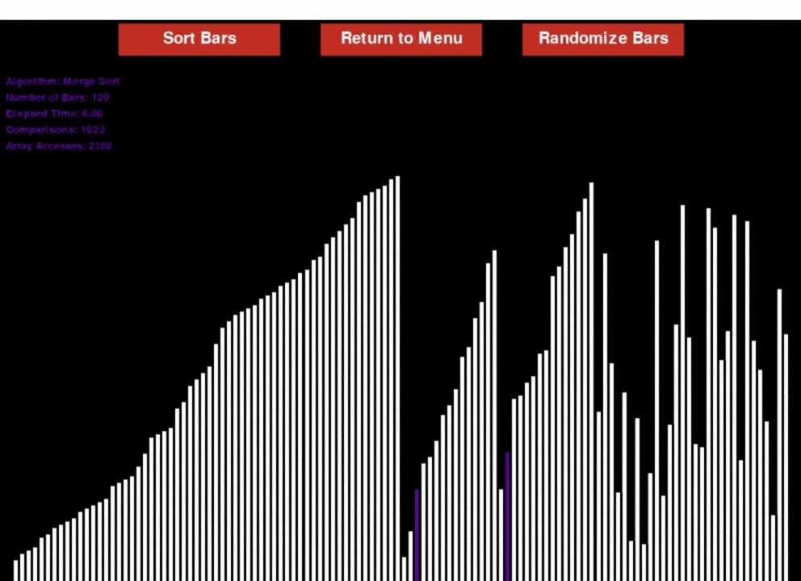

# Sorting Algorithms Visualizer

> A Python and Pygame application designed to visualize the inner workings of different sorting algorithms in real-time.

<br>



---

## About This Project

This project was born out of a passion for the fundamentals of Computer Science. The goal was to go beyond theory and to see, in a visual and interactive way, how sorting algorithms actually work by comparing their different approaches and efficiencies.

The application generates a random array of values and allows the user to select an algorithm to visualize its sorting process step-by-step.

---

## Features

- **Real-Time Visualization:** Watch every swap and comparison the algorithm makes.
- **Multiple Algorithms:** Implementation of several classic sorting algorithms for comparison (in process).

---

## Implemented Algorithms

- Bubble Sort
- Insertion Sort
- Merge Sort
- Quick Sort
- More will be implemented in the future.

---

## Technologies Used

- **Language:** Python
- **Graphics Library:** pygame, pygame-gui

---

## How to Run

```bash
# 1. Clone the repository
git clone https://github.com/henry-mesquita/sorting-algorithms.git

# 2. Navigate to the project directory
cd sorting-algorithms

# 3. (Optional) Create and activate a virtual environment
python -m venv venv
source venv/bin/activate # On Windows: venv\Scripts\activate

# 4. Install the dependencies
pip install -r requirements.txt

# 5. Run the application
python main.py # or the name of your main script
```

## Author
Developed by **Henry Mesquita**.
